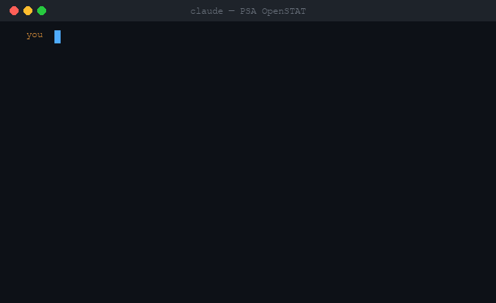

# ph-civic-data-mcp

<!-- mcp-name: io.github.xmpuspus/ph-civic-data-mcp -->

> The multi-source MCP server for Philippine civic data. Earthquakes, weather, typhoons, procurement, population, poverty, solar radiation, air quality, satellite vegetation indices, and macro indicators — all in your AI agent, no API keys required.

[](https://pypi.org/project/ph-civic-data-mcp/)
[](https://www.python.org/downloads/)
[](https://opensource.org/licenses/MIT)
[](https://glama.ai/mcp/servers/xmpuspus/ph-civic-data-mcp)
[](https://registry.modelcontextprotocol.io/v0.1/servers?search=ph-civic-data-mcp)

`ph-civic-data-mcp` is a zero-cost, `stdio`-transport MCP server. **v0.2.0** adds six no-auth scientific + open-data sources — NASA POWER, Open-Meteo Air Quality, NASA MODIS (via ORNL DAAC), USGS FDSN, NOAA IBTrACS, and World Bank Open Data — on top of the original four Philippine government feeds (PHIVOLCS, PAGASA, PhilGEPS, PSA). 17 tools total. Boots and runs with zero API keys.

## This is how easy it is to set up

One JSON file. One `claude` command. Your agent just correlated live Philippine weather with 2020 Census population data in a single turn.


The recording above isn't scripted. It's `vhs docs/demo_setup.tape`, which spawns Claude Code with `--mcp-config` pointing at this server, and Claude fans out in parallel to `get_weather_forecast` (Open-Meteo) and `get_population_stats` (PSA PXWeb), then correlates them. The temperatures (30.4 / 30.9 / 31.0 °C max over Apr 19-21) and NCR population (13,484,462) in the streamed answer are what the live sources returned at the moment of the recording.

Works the same way in Claude Desktop, Cursor, Zed, VS Code, or any MCP-compatible client. One `"command": "uvx"`, one `"args": ["ph-civic-data-mcp"]`, done.

## Demo

Every GIF below is a real VHS recording of `docs/live_demo.py`. It spawns `uvx ph-civic-data-mcp` from this PyPI release and calls each tool over the real MCP stdio protocol. The panels you see contain the actual JSON returned by the server. Nothing is staged.

A grand tour hitting 7 tools across all 4 sources in one session:


Per-source walkthroughs below. To reproduce any of them locally: `uv run python docs/live_demo_single.py <suite>`.

## Why this exists

Philippine civic-data portals publish open data, but each in its own schema — scraped HTML tables, PXWeb JSON, undocumented APIs. Nothing ties them together for an AI agent. This server does.

A handful of other Philippine civic-data MCP servers exist (PSGC administrative geography, holidays, DHSUD license-to-sell, DepEd schools), each covering one dataset. None expose hazard feeds, weather, procurement, or statistical data, and none combine sources. This server does both. See the Prior art section below for the full list.

## Install

```bash
uvx ph-civic-data-mcp
```

Or via pip:

```bash
pip install ph-civic-data-mcp
```

## Setup

### Claude Desktop

Add to `~/Library/Application Support/Claude/claude_desktop_config.json`:

```json
{
  "mcpServers": {
    "ph-civic-data": {
      "command": "uvx",
      "args": ["ph-civic-data-mcp"]
    }
  }
}
```

### Claude Code

Add to `.claude/settings.json`:

```json
{
  "mcpServers": {
    "ph-civic-data": {
      "command": "uvx",
      "args": ["ph-civic-data-mcp"]
    }
  }
}
```

Or install via the Claude Code CLI:

```bash
claude mcp add ph-civic-data -- uvx ph-civic-data-mcp
```

### Cursor, Zed, other MCP clients

Any client that supports the stdio MCP transport works. Point the command at `uvx ph-civic-data-mcp`. No API keys required for the default configuration.

## What you can ask

After setup, ask your agent:

- _"How hot is Metro Manila this week and how many people are affected?"_
- _"What earthquakes happened in the Philippines in the last 24 hours?"_
- _"Is Taal volcano active right now?"_
- _"What's the 3-day weather forecast for Quezon City?"_
- _"Are there active typhoons in the Philippines right now?"_
- _"Search PhilGEPS for flood control contracts."_
- _"What is the population of Region VII based on the PSA?"_
- _"What is the poverty incidence in the Bicol Region?"_
- _"Give me a multi-hazard risk profile for Leyte."_
- _"What's the solar irradiance in Ilocos Norte this week? Good site for a PV farm?"_ **(v0.2.0)**
- _"Compare air quality in Makati and Cebu City right now."_ **(v0.2.0)**
- _"What do MODIS NDVI composites say about vegetation health over the Nueva Ecija rice bowl?"_ **(v0.2.0)**
- _"Cross-check the magnitudes that PHIVOLCS and USGS assigned to last week's events."_ **(v0.2.0)**
- _"List all typhoons that passed through the PAR in the 2024 season."_ **(v0.2.0)**
- _"What's the Philippines' GDP growth and poverty ratio over the last decade?"_ **(v0.2.0)**

## Per-source demos

### PHIVOLCS — earthquakes + volcano alert levels


### PAGASA — weather forecast + typhoon tracking


### PhilGEPS — procurement search + aggregation


### PSA — population (2020 Census) + poverty (2023 Full-Year)


### Cross-source — parallel multi-hazard risk profile


### How the demos are produced

`docs/live_demo.py` and `docs/live_demo_single.py` open an MCP `StdioTransport` pointing at `uvx ph-civic-data-mcp` (which resolves to this PyPI release), call the tools, and render the responses with [Rich](https://github.com/Textualize/rich) (panels, tables, syntax-highlighted JSON, live spinners). [`vhs`](https://github.com/charmbracelet/vhs) drives a real terminal and records the session. Tapes are committed under `docs/*.tape`.

## Data sources

| Source | Data | Update frequency | Auth |
|---|---|---|---|
| PHIVOLCS | Earthquakes, bulletins, volcano alerts | 5 min (earthquakes), 30 min (volcanoes) | None |
| PAGASA | 10-day weather, active typhoons, alerts | Hourly | Optional `PAGASA_API_TOKEN` |
| Open-Meteo | Weather fallback when PAGASA token absent | Hourly | None |
| PhilGEPS | Government procurement notices (latest ~100) | 6 h (cached) | None |
| PSA OpenSTAT | Population (2020 Census), poverty (2023) | Periodic | None |
| **NASA POWER** *(v0.2.0)* | Daily solar irradiance + temp/precip/wind, any lat/lng | Daily | None |
| **Open-Meteo Air Quality** *(v0.2.0)* | PM2.5/PM10/NO2/SO2/O3/CO + AQI | Hourly | None |
| **NASA MODIS via ORNL DAAC** *(v0.2.0)* | NDVI/EVI vegetation indices (250m, 16-day composites) | Weekly | None |
| **USGS FDSN** *(v0.2.0)* | Philippine-region earthquakes from global seismic network | Minutes | None |
| **NOAA IBTrACS** *(v0.2.0)* | Historical tropical cyclone tracks through the PAR | Per storm | None |
| **World Bank Open Data** *(v0.2.0)* | Philippine macro indicators (GDP, poverty ratio, inflation, etc.) | Annual | None |

## All tools

| Tool | Description | Key params |
|---|---|---|
| `get_latest_earthquakes` | Recent PH earthquakes | `min_magnitude`, `limit`, `region` |
| `get_earthquake_bulletin` | Full PHIVOLCS bulletin for one event | `bulletin_url` |
| `get_volcano_status` | Alert level per monitored PH volcano | `volcano_name` |
| `get_weather_forecast` | 1–10 day forecast (PAGASA or Open-Meteo) | `location`, `days` |
| `get_active_typhoons` | Active tropical cyclones in/near PAR | — |
| `get_weather_alerts` | Active PAGASA warnings | `region` |
| `search_procurement` | Keyword search on PhilGEPS notices | `keyword`, `agency`, `region`, `date_from/to`, `limit` |
| `get_procurement_summary` | Aggregate procurement stats | `agency`, `region`, `year` |
| `get_population_stats` | 2020 Census population | `region` |
| `get_poverty_stats` | 2023 Full-Year poverty incidence | `region` |
| `assess_area_risk` | Multi-hazard profile (parallel PHIVOLCS + PAGASA) | `location` |
| **`get_solar_and_climate`** *(v0.2.0)* | NASA POWER daily solar irradiance + climate variables at any coordinate | `latitude`, `longitude`, `start_date`, `end_date` |
| **`get_air_quality`** *(v0.2.0)* | Real-time air quality for ~80 major PH cities via Open-Meteo | `location` |
| **`get_vegetation_index`** *(v0.2.0)* | MODIS NDVI + EVI vegetation index timeseries at any coordinate | `latitude`, `longitude`, `start_date`, `end_date` |
| **`get_usgs_earthquakes_ph`** *(v0.2.0)* | PH-bbox earthquakes from USGS global network (cross-ref to PHIVOLCS) | `start_date`, `end_date`, `min_magnitude`, `limit` |
| **`get_historical_typhoons_ph`** *(v0.2.0)* | Historical typhoons that passed through the Philippine AOR (IBTrACS) | `year`, `limit` |
| **`get_world_bank_indicator`** *(v0.2.0)* | Philippine macro indicator from World Bank Open Data (code or friendly alias) | `indicator`, `per_page` |

## Environment variables

| Variable | Required | Notes |
|---|---|---|
| `PAGASA_API_TOKEN` | Optional | Requires formal PAGASA request. Without it, weather auto-falls-back to Open-Meteo. |

No mandatory API keys. The server boots and all 17 tools work without any token.

## Data freshness warnings

- **Population:** 2020 Census. No later national data exists yet.
- **Poverty:** 2023 Full-Year poverty statistics (latest PSA release).
- **Procurement:** PhilGEPS open data does not expose filterable search externally. This server scrapes the latest ~100 bid notices and filters client-side. Cached 6h.
- **Emergencies:** for real-time disaster response, always check [ndrrmc.gov.ph](https://ndrrmc.gov.ph) and official PHIVOLCS/PAGASA channels. This server is for research, not life-safety decisions.

## Architecture

- Python 3.11+, `fastmcp>=3.0.0,<4.0.0`
- Two HTTP clients: standard + `PHIVOLCS_CLIENT` with `verify=False` (PHIVOLCS has a broken SSL cert chain). SSL verification is **never** disabled globally.
- In-memory TTL caches per source; no disk writes.
- stdio transport only (zero hosting cost).
- PSA table paths are discovered via the PXWeb browse API, never hardcoded.

## Development

```bash
git clone https://github.com/xmpuspus/ph-civic-data-mcp
cd ph-civic-data-mcp
uv sync --extra dev

# MCP Inspector
fastmcp dev src/ph_civic_data_mcp/server.py

# Tests (run against live APIs)
uv run pytest tests/ -v

# Build
uv run python -m build
uv run twine check dist/*
```

## Limitations

- **PAGASA token is gated.** Non-government users may be denied. Open-Meteo fallback removes this as a hard dependency.
- **PhilGEPS is not real-time.** Public portal exposes no filterable API; this server operates on the latest ~100 notices with client-side filtering.
- **Emergencies:** direct users to official channels; this is a research tool.

## What's new in v0.2.0 — six new no-auth sources

### Correlation demo: "Why is Metro Manila so hot right now?"


One unscripted `claude -p --mcp-config` call, real MCP stdio transport, live upstream APIs. Claude picks three sources out of the 17 tools — **PAGASA/Open-Meteo 7-day forecast** (v0.1.x), **NASA POWER solar irradiance** (v0.2.0, new), and **Open-Meteo Air Quality** (v0.2.0, new) — then correlates them into a three-sentence answer. The numbers in the response (6.8–7.3 kWh/m²/day irradiance, 30.3–31.8°C daytime temps, PM2.5 24.8 µg/m³, US AQI 91) are exactly what the live endpoints returned at the moment of recording. Tape: `docs/demo_correlation.tape`.

### Per-tool live outputs

Every JSON block below is the **actual** response from each tool, captured by running `uv run python docs/live_probe_v020.py` against live public APIs on the release date. No placeholders, no truncation tricks — lists were clipped to fit.

### `get_solar_and_climate` — NASA POWER

Daily solar irradiance + climate at any coordinate. Useful for PV siting and agricultural modeling.

```
$ get_solar_and_climate(latitude=14.5995, longitude=120.9842,
                        start_date="2026-04-01", end_date="2026-04-07")
```

```json
{
  "latitude": 14.5995,
  "longitude": 120.9842,
  "start_date": "2026-04-01",
  "end_date": "2026-04-07",
  "days": [
    {"date": "2026-04-01", "solar_irradiance_kwh_m2": 6.79, "temp_c": 25.4, "precipitation_mm": 0.11, "windspeed_ms": 2.11},
    {"date": "2026-04-02", "solar_irradiance_kwh_m2": 7.18, "temp_c": 24.9, "precipitation_mm": 0.01, "windspeed_ms": 2.45},
    {"date": "2026-04-03", "solar_irradiance_kwh_m2": 7.13, "temp_c": 25.3, "precipitation_mm": 0.17, "windspeed_ms": 2.23}
  ],
  "source": "NASA POWER",
  "data_retrieved_at": "2026-04-20T00:12:13Z"
}
```

### `get_air_quality` — Open-Meteo Air Quality

Fills the gap that AQICN left when it was removed in v0.1.8. No auth, reliable PH coverage.

```
$ get_air_quality(location="Manila")
```

```json
{
  "location": "Manila",
  "latitude": 14.5995,
  "longitude": 120.9842,
  "measured_at": "2026-04-20T08:00:00Z",
  "pm2_5": 24.8,
  "pm10": 34.3,
  "carbon_monoxide": 521.0,
  "nitrogen_dioxide": 11.6,
  "sulphur_dioxide": 15.5,
  "ozone": 81.0,
  "european_aqi": 65,
  "us_aqi": 91,
  "aqi_category": "Moderate",
  "source": "Open-Meteo Air Quality",
  "data_retrieved_at": "2026-04-20T00:12:13Z"
}
```

### `get_vegetation_index` — NASA MODIS via ORNL DAAC

NDVI + EVI at 250m, 16-day composites. MOD13Q1 product. Useful for monitoring crops, droughts, and deforestation. Here — a rice-bowl pixel in Nueva Ecija going through the growing cycle:

```
$ get_vegetation_index(latitude=15.58, longitude=121.0,
                       start_date="2026-01-01", end_date="2026-04-18")
```

```json
{
  "latitude": 15.58,
  "longitude": 121.0,
  "product": "MOD13Q1",
  "band": "NDVI+EVI (250m, 16-day composite)",
  "samples": [
    {"composite_date": "2026-01-01", "ndvi": 0.708, "evi": 0.343},
    {"composite_date": "2026-01-17", "ndvi": 0.856, "evi": 0.582},
    {"composite_date": "2026-02-02", "ndvi": 0.898, "evi": 0.703}
  ],
  "source": "NASA MODIS via ORNL DAAC",
  "data_retrieved_at": "2026-04-20T00:12:17Z"
}
```

### `get_usgs_earthquakes_ph` — USGS FDSN

Global-network seismic catalogue, filtered to the PH bounding box. Useful for cross-validating PHIVOLCS local magnitudes against USGS Mww/Mwc solutions.

```
$ get_usgs_earthquakes_ph(min_magnitude=5.0, limit=10)
```

```json
[
  {
    "datetime_utc": "2026-04-06T07:22:42Z",
    "magnitude": 5.2,
    "magnitude_type": "mww",
    "depth_km": 10.0,
    "latitude": 10.8435,
    "longitude": 123.8752,
    "place": "0 km S of Tabonok, Philippines",
    "usgs_event_id": "us6000sn00",
    "felt_reports": 37,
    "tsunami": false,
    "url": "https://earthquake.usgs.gov/earthquakes/eventpage/us6000sn00",
    "source": "USGS FDSN"
  },
  {
    "datetime_utc": "2026-04-04T10:34:28Z",
    "magnitude": 6.0,
    "magnitude_type": "mww",
    "depth_km": 67.0,
    "latitude": 4.8733,
    "longitude": 126.1392,
    "place": "95 km SE of Sarangani, Philippines",
    "usgs_event_id": "us6000smj4",
    "tsunami": false,
    "url": "https://earthquake.usgs.gov/earthquakes/eventpage/us6000smj4",
    "source": "USGS FDSN"
  }
]
```

### `get_historical_typhoons_ph` — NOAA IBTrACS

Every typhoon that has passed through the Philippine Area of Responsibility, from the authoritative IBTrACS track archive. Aggregates track points per storm, falls back across agency wind/pressure solutions (WMO → JTWC → JMA) to populate peak intensity.

```
$ get_historical_typhoons_ph(limit=3)
```

```json
[
  {
    "sid": "2025329N10124",
    "name": "KOTO",
    "season": 2025,
    "basin": "WP",
    "max_wind_kt": 80.0,
    "min_pressure_mb": 975.0,
    "start_time_utc": "2025-11-24T18:00:00Z",
    "end_time_utc": "2025-12-03T00:00:00Z",
    "track_points": 67,
    "passed_within_par": true,
    "source": "NOAA IBTrACS"
  },
  {
    "sid": "2025308N10143",
    "name": "FUNG-WONG",
    "season": 2025,
    "basin": "WP",
    "max_wind_kt": 115.0,
    "min_pressure_mb": 943.0,
    "track_points": 75,
    "passed_within_par": true,
    "source": "NOAA IBTrACS"
  },
  {
    "sid": "2025305N10138",
    "name": "KALMAEGI",
    "season": 2025,
    "basin": "WP",
    "max_wind_kt": 115.0,
    "min_pressure_mb": 948.0,
    "track_points": 43,
    "passed_within_par": true,
    "source": "NOAA IBTrACS"
  }
]
```

### `get_world_bank_indicator` — World Bank Open Data

Any World Bank indicator for the Philippines. Accepts the canonical WB code (e.g. `NY.GDP.MKTP.CD`) or a friendly alias from a curated list (`gdp`, `gdp_per_capita`, `poverty_ratio`, `inflation`, `urban_population_pct`, `internet_users_pct`, `gini`, `tax_revenue_pct_gdp`, etc. — 25 aliases in total).

```
$ get_world_bank_indicator(indicator="gdp", per_page=10)
```

```json
{
  "indicator_id": "NY.GDP.MKTP.CD",
  "indicator_name": "GDP (current US$)",
  "country": "Philippines",
  "country_iso3": "PHL",
  "observations": [
    {"year": 2024, "value": 461617509782.36, "unit": ""},
    {"year": 2023, "value": 437055627244.42, "unit": ""},
    {"year": 2022, "value": 404353369604.63, "unit": ""}
  ],
  "source": "World Bank Open Data"
}
```

## Roadmap (v0.3.0)

Requires deeper reverse-engineering than this release — shipped separately when ready:

- `get_active_disasters` / `get_situational_report` via NDRRMC monitoring dashboard (intermittent availability)
- `assess_hazard(lat, lng)` via HazardHunterPH — the top-level GeoRisk ArcGIS catalog is public, but the individual PHIVOLCS/MGB hazard layers (flood, landslide, liquefaction) return `"code": 499, "message": "Token Required"`. Needs a different integration strategy
- `get_flood_layers(lat, lng)` via Project NOAH — current site is an Angular SPA whose XHR surface needs browser-level capture. Deferred
- DPWH transparency portal — 250k+ infrastructure projects. Portal returns 403 to anonymous fetches; needs a proper session strategy

## Prior art

Other Philippine civic-data MCP servers, each single-dataset:

- [GodModeArch/psgc-mcp](https://glama.ai/mcp/servers/@GodModeArch/psgc-mcp) — PSA Philippine Standard Geographic Code (administrative hierarchy)
- [GodModeArch/ph-holidays-mcp](https://glama.ai/mcp/servers/GodModeArch/ph-holidays-mcp) — Philippine national holidays from the Official Gazette
- [GodModeArch/lts-mcp](https://glama.ai/mcp/servers/GodModeArch/lts-mcp) — DHSUD License to Sell registry
- [xiaobenyang-com/Philippine-Geocoding](https://glama.ai/mcp/servers/@xiaobenyang-com/Philippine-Geocoding) — PSGC geocoding
- [darwinphi/ph-schools-mcp-server](https://github.com/darwinphi/ph-schools-mcp-server) — DepEd schools masterlist

Non-MCP libraries that inspired this project:

- [panukatan/lindol](https://github.com/panukatan/lindol) — R package for PHIVOLCS earthquakes
- [pagasa-parser](https://github.com/pagasa-parser) — JS org for PAGASA data parsing

`ph-civic-data-mcp` is the first MCP that unifies multiple Philippine civic-data sources (PHIVOLCS, PAGASA, PhilGEPS, PSA) behind one interface, and the first to expose hazards, weather, procurement, statistical data, solar/climate, air quality, satellite vegetation indices, and macro indicators (v0.2.0) as MCP tools. Credit to all of the above.

## License

MIT. Xavier Puspus. Not affiliated with PHIVOLCS, PAGASA, PhilGEPS, or PSA.

## Contributing

Issues and PRs welcome at [github.com/xmpuspus/ph-civic-data-mcp](https://github.com/xmpuspus/ph-civic-data-mcp).
